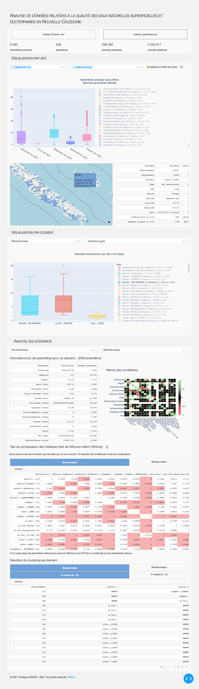

# Application dash

Cette application dash (codé en Python 3) permet d'afficher les différents bloxplots de chaque paramètre.
Les boxplots peuvent être filtrés par RegionHydro, puis par site/rivière.

Pour cela, il faut absolument avoir une matrice statistique (par exemple le fichier `matrice_statistique.csv`).
Pour que l'application fonctionne correctement, il faut que la matrice statistique soit de cette forme ci-dessous:

| IDPrelevement      |     Filtre_1    |   Filtre_2   |   Latitude   |   Longitude   |   Paramètre_1   |   Paramètre_2   |   ...    |   Paramètre_n |
|:------------------|:-------------:|:-----------:|:-----------:|:-----------:|:--------------:|:--------------:|:-------:|:------------:|
| ...                |      ...        |    ...       |    ...       |    ...       |      ...        |      ...        |    ...   |     ...       |
| ...                |      ...        |    ...       |    ...       |    ...       |      ...        |      ...        |    ...   |     ...       |
| ...                |      ...        |    ...       |    ...       |    ...       |      ...        |      ...        |    ...   |     ...       |

Pour afficher les différents boxplots, le script ne prendra bien sûr pas en compte les champs vides, il est donc normal que chaque boxplot ne soit pas généré par le même nombre d'observations.
Sur cette application, il est aussi possible d'activer (ou non) un filtre de Tukey. Le filtre de Tukey est un critère pour considérer si une valeur est considérée comme étant une valeur extrême.
Soit  une valeur présente dans la matrice pour un paramètre .
 est considérée comme étant une valeur extrême si elle n'est pas comprise dans l'intervalle [ ; ]
avec  le premier quartile,  le troisième quartile et  l'écart interquartile (ie. ).

______________________

**UPDATE**

*23/02/2021* : La version 2.5 répare quelques bugs au niveau des appels de fonctions. Elle ajoute une optimisation considérable du traitement du fichier chargé (temps de chargement au moins 3 fois plus rapide d'après nos tests).

______________________

*Il paraît qu'une image vaut mieux que mille mots. Du coup, pourquoi s'en priver ?*

